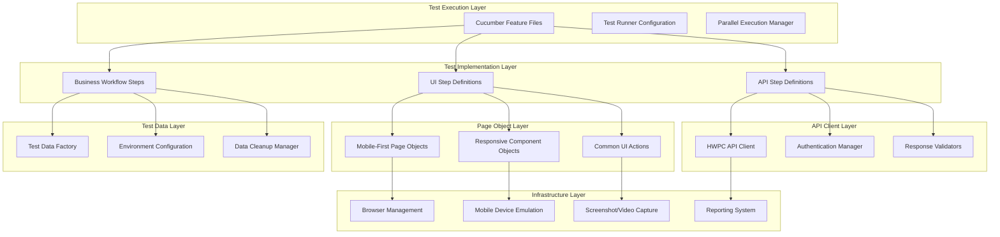

# Design Document

## Overview

This design document outlines a comprehensive testing strategy for the HWPC system that addresses the inconsistencies identified between the existing specs and creates a unified approach for testing pest control/service management functionality. The design builds upon the existing Playwright + Cucumber framework while incorporating best practices from both the ui-testing-infrastructure and pest-control-route-system specs.

The approach recognizes that HWPC is a service management system similar to the pest control route system, requiring comprehensive testing of customer management, ticket lifecycle, route planning, and mobile-first user experience. This design creates a testing framework that can validate both the technical implementation and business workflow requirements.

## Architecture

### Unified Testing Architecture



### Enhanced Directory Structure

Building on the existing framework structure with comprehensive coverage:

```
features/hwpc/
├── ticket-management.feature          # Complete ticket lifecycle testing
├── customer-management.feature        # Customer CRUD and relationship testing
├── route-planning.feature             # Route creation, optimization, printing
├── mobile-workflows.feature           # Mobile-specific user journeys
├── api-comprehensive.feature          # Extended API testing beyond current hwpc_api.feature
├── business-workflows.feature         # End-to-end business process testing
├── error-handling.feature             # Comprehensive error scenario testing
└── performance-testing.feature        # Mobile performance and load testing

src/hwpc/
├── constants/
│   ├── HWPCConstants.ts              # Enhanced constants for all HWPC elements
│   ├── APIEndpoints.ts               # Comprehensive API endpoint definitions
│   ├── TestData.ts                   # Test data templates and generators
│   └── MobileViewports.ts            # Mobile device configurations
├── pages/
│   ├── base/
│   │   ├── BasePage.ts               # Enhanced base page with mobile support
│   │   └── MobileBasePage.ts         # Mobile-specific base functionality
│   ├── ticket/
│   │   ├── TicketListPage.ts         # Ticket listing and search
│   │   ├── TicketCreatePage.ts       # Ticket creation form
│   │   ├── TicketDetailPage.ts       # Ticket viewing and editing
│   │   └── TicketMobilePage.ts       # Mobile-specific ticket interactions
│   ├── customer/
│   │   ├── CustomerListPage.ts       # Customer directory and search
│   │   ├── CustomerCreatePage.ts     # Customer creation form
│   │   ├── CustomerDetailPage.ts     # Customer profile and history
│   │   └── CustomerMobilePage.ts     # Mobile customer management
│   ├── route/
│   │   ├── RouteListPage.ts          # Route overview and management
│   │   ├── RoutePlanningPage.ts      # Route creation and optimization
│   │   ├── RoutePrintPage.ts         # Print preview and export
│   │   └── RouteMobilePage.ts        # Mobile route management
│   └── common/
│       ├── NavigationPage.ts         # Site navigation and menus
│       ├── DashboardPage.ts          # Main dashboard functionality
│       └── MobileNavigationPage.ts   # Mobile-specific navigation
├── steps/
│   ├── ui/
│   │   ├── TicketManagementSteps.ts  # Comprehensive ticket UI steps
│   │   ├── CustomerManagementSteps.ts # Customer UI interaction steps
│   │   ├── RouteManagementSteps.ts   # Route planning UI steps
│   │   ├── MobileInteractionSteps.ts # Mobile-specific interaction steps
│   │   └── BusinessWorkflowSteps.ts  # End-to-end workflow steps
│   ├── api/
│   │   ├── TicketAPISteps.ts         # Enhanced ticket API testing
│   │   ├── CustomerAPISteps.ts       # Customer API operations
│   │   ├── RouteAPISteps.ts          # Route API functionality
│   │   ├── AuthenticationSteps.ts    # Authentication and session management
│   │   └── IntegrationSteps.ts       # API-UI integration validation
│   └── common/
│       ├── TestDataSteps.ts          # Test data setup and cleanup
│       ├── EnvironmentSteps.ts       # Environment configuration steps
│       └── ValidationSteps.ts        # Common validation steps
├── api/
│   ├── HWPCAPIClient.ts              # Enhanced API client with full coverage
│   ├── AuthenticationManager.ts      # Session and auth management
│   ├── ResponseValidator.ts          # API response validation utilities
│   └── APITestDataManager.ts         # API-specific test data handling
├── utils/
│   ├── TestDataFactory.ts            # Comprehensive test data generation
│   ├── MobileTestUtils.ts            # Mobile testing utilities
│   ├── BusinessWorkflowUtils.ts      # Business process helpers
│   └── DataCleanupManager.ts         # Test data cleanup utilities
└── config/
    ├── HWPCTestConfig.ts             # HWPC-specific test configuration
    ├── MobileDeviceConfig.ts         # Mobile device profiles
    └── EnvironmentConfig.ts          # Environment-specific settings
```

## Components and Interfaces

### Enhanced Page Object Model

#### Mobile-First Base Page Architecture

```typescript
// Enhanced BasePage with mobile-first approach
abstract class BasePage {
  protected page: Page;
  protected isMobile: boolean;
  protected viewport: ViewportSize;
  
  constructor(page: Page) {
    this.page = page;
    this.detectMobileViewport();
  }
  
  // Mobile-aware interaction methods
  async clickElement(selector: string, options?: ClickOptions): Promise<void>
  async typeText(selector: string, text: string, options?: TypeOptions): Promise<void>
  async waitForElement(selector: string, options?: WaitOptions): Promise<void>
  async scrollToElement(selector: string): Promise<void>
  
  // Mobile-specific methods
  async swipeElement(selector: string, direction: SwipeDirection): Promise<void>
  async longPressElement(selector: string): Promise<void>
  async pinchZoom(selector: string, scale: number): Promise<void>
  
  // Responsive design validation
  async validateResponsiveLayout(): Promise<void>
  async checkMobileOptimization(): Promise<void>
}
```

#### Business-Focused Page Objects

**TicketManagementPage**
- Comprehensive ticket CRUD operations
- Advanced search and filtering capabilities
- Mobile-optimized form interactions
- Status workflow management
- Bulk operations support

**CustomerManagementPage**
- Customer directory with search
- Customer profile management
- Service history tracking
- Mobile-friendly contact management
- Customer-ticket relationship handling

**RoutePlanningPage**
- Route creation and optimization
- Drag-and-drop ticket assignment (with touch support)
- Route visualization and mapping
- Print preview and export functionality
- Mobile route management interface

### API Client Architecture

#### Comprehensive HWPC API Client

```typescript
class HWPCAPIClient extends BaseAPIClient {
  // Authentication and session management
  async authenticate(credentials: AuthCredentials): Promise<AuthResponse>
  async refreshSession(): Promise<void>
  async logout(): Promise<void>
  
  // Ticket management endpoints
  async createTicket(ticketData: TicketCreateRequest): Promise<TicketResponse>
  async getTicket(ticketId: string): Promise<TicketResponse>
  async updateTicket(ticketId: string, updates: TicketUpdateRequest): Promise<TicketResponse>
  async deleteTicket(ticketId: string): Promise<void>
  async searchTickets(criteria: TicketSearchCriteria): Promise<TicketListResponse>
  async getTicketsByCustomer(customerId: string): Promise<TicketListResponse>
  async getTicketsByRoute(routeId: string): Promise<TicketListResponse>
  async updateTicketStatus(ticketId: string, status: TicketStatus): Promise<TicketResponse>
  
  // Customer management endpoints
  async createCustomer(customerData: CustomerCreateRequest): Promise<CustomerResponse>
  async getCustomer(customerId: string): Promise<CustomerResponse>
  async updateCustomer(customerId: string, updates: CustomerUpdateRequest): Promise<CustomerResponse>
  async deleteCustomer(customerId: string): Promise<void>
  async searchCustomers(criteria: CustomerSearchCriteria): Promise<CustomerListResponse>
  async getCustomerHistory(customerId: string): Promise<ServiceHistoryResponse>
  
  // Route management endpoints
  async createRoute(routeData: RouteCreateRequest): Promise<RouteResponse>
  async getRoute(routeId: string): Promise<RouteResponse>
  async updateRoute(routeId: string, updates: RouteUpdateRequest): Promise<RouteResponse>
  async deleteRoute(routeId: string): Promise<void>
  async assignTicketToRoute(routeId: string, ticketId: string): Promise<void>
  async removeTicketFromRoute(routeId: string, ticketId: string): Promise<void>
  async optimizeRoute(routeId: string): Promise<RouteOptimizationResponse>
  async getRoutePrintData(routeId: string): Promise<RoutePrintResponse>
  
  // Business intelligence endpoints
  async getDashboardData(): Promise<DashboardResponse>
  async getTicketStatistics(dateRange?: DateRange): Promise<StatisticsResponse>
  async getPerformanceMetrics(): Promise<PerformanceResponse>
}
```

### Step Definition Architecture

#### Business Workflow Step Definitions

```typescript
// Business workflow steps that combine UI and API validation
class BusinessWorkflowSteps {
  @Given('a customer service request is received')
  async customerServiceRequestReceived(): Promise<void>
  
  @When('the service coordinator creates a ticket for the customer')
  async serviceCoordinatorCreatesTicket(): Promise<void>
  
  @And('assigns the ticket to a technician route')
  async assignTicketToTechnicianRoute(): Promise<void>
  
  @Then('the technician can view the ticket on their mobile device')
  async technicianViewsTicketOnMobile(): Promise<void>
  
  @And('complete the service and update the ticket status')
  async completeServiceAndUpdateStatus(): Promise<void>
  
  @Then('the customer and coordinator are notified of completion')
  async verifyCompletionNotifications(): Promise<void>
}
```

## Data Models

### Comprehensive Test Data Models

```typescript
// Enhanced data models for comprehensive testing
interface TicketTestData {
  id?: string;
  customerId: string;
  title: string;
  description: string;
  priority: 'low' | 'medium' | 'high' | 'urgent';
  status: 'open' | 'assigned' | 'in_progress' | 'completed' | 'cancelled';
  serviceType: string;
  scheduledDate: Date;
  estimatedDuration: number;
  specialInstructions?: string;
  routeId?: string;
  technicianId?: string;
  createdAt?: Date;
  updatedAt?: Date;
}

interface CustomerTestData {
  id?: string;
  companyName: string;
  contactName: string;
  address: AddressData;
  phone: string;
  email: string;
  serviceType: string[];
  specialInstructions?: string;
  preferredTechnician?: string;
  serviceHistory?: ServiceHistoryData[];
  createdAt?: Date;
  updatedAt?: Date;
}

interface RouteTestData {
  id?: string;
  name: string;
  date: Date;
  technicianId: string;
  status: 'draft' | 'active' | 'completed';
  tickets: string[];
  estimatedDuration: number;
  actualDuration?: number;
  startLocation: LocationData;
  endLocation: LocationData;
  optimized: boolean;
  notes?: string;
}
```

### Test Data Factory

```typescript
class TestDataFactory {
  // Generate realistic test data for different scenarios
  static generateTicket(overrides?: Partial<TicketTestData>): TicketTestData
  static generateCustomer(overrides?: Partial<CustomerTestData>): CustomerTestData
  static generateRoute(overrides?: Partial<RouteTestData>): RouteTestData
  
  // Generate related data sets
  static generateCustomerWithTickets(ticketCount: number): { customer: CustomerTestData, tickets: TicketTestData[] }
  static generateRouteWithTickets(ticketCount: number): { route: RouteTestData, tickets: TicketTestData[], customers: CustomerTestData[] }
  
  // Generate data for specific test scenarios
  static generateHighPriorityTickets(count: number): TicketTestData[]
  static generateOverdueTickets(count: number): TicketTestData[]
  static generateMobileOptimizedData(): TestDataSet
}
```

## Error Handling

### Comprehensive Error Handling Strategy

#### UI Error Handling
- **Mobile-Specific Errors**: Handle touch interaction failures, viewport issues, and mobile browser quirks
- **Responsive Layout Validation**: Detect and report layout problems across different screen sizes
- **Network Connectivity**: Handle mobile network instability and offline scenarios
- **Performance Issues**: Detect and report slow loading times and unresponsive interactions

#### API Error Handling
- **Authentication Failures**: Handle session timeouts, invalid credentials, and permission errors
- **Business Logic Errors**: Validate proper error responses for invalid operations and data conflicts
- **Rate Limiting**: Handle API rate limits and implement appropriate retry strategies
- **Data Validation**: Verify proper validation error responses and field-level error messages

#### Test Framework Error Handling
- **Test Data Conflicts**: Detect and resolve test data conflicts in parallel execution
- **Environment Issues**: Handle environment-specific configuration problems
- **Browser/Device Issues**: Manage browser crashes, device emulation problems, and driver issues
- **Reporting Failures**: Ensure test results are captured even when reporting systems fail

## Testing Strategy

### Multi-Layer Testing Approach

#### 1. Unit-Level Component Testing
- Individual page object method validation
- API client method testing
- Test data generation validation
- Mobile interaction utility testing

#### 2. Integration Testing
- UI-API data consistency validation
- Cross-page navigation and state management
- Authentication and session management
- Mobile-desktop feature parity testing

#### 3. Business Workflow Testing
- End-to-end customer service scenarios
- Technician daily workflow validation
- Administrative task completion
- Error recovery and edge case handling

#### 4. Performance and Load Testing
- Mobile page load time validation
- API response time testing
- Concurrent user scenario testing
- Mobile network condition simulation

### Mobile-First Testing Strategy

#### Device Coverage
- **Primary Mobile Devices**: iPhone 12/13/14, Samsung Galaxy S21/S22, Google Pixel 6/7
- **Tablet Coverage**: iPad Air, Samsung Galaxy Tab, Surface Pro
- **Desktop Coverage**: Chrome, Firefox, Safari, Edge on Windows/Mac/Linux

#### Mobile-Specific Test Scenarios
- **Touch Interactions**: Tap, swipe, pinch, long-press, drag-and-drop
- **Orientation Changes**: Portrait/landscape mode switching
- **Network Conditions**: 3G, 4G, WiFi, offline scenarios
- **Mobile Features**: Camera integration, GPS functionality, mobile printing

#### Responsive Design Validation
- **Breakpoint Testing**: Validate layout at all responsive breakpoints
- **Content Adaptation**: Verify content reflows appropriately
- **Navigation Patterns**: Test mobile navigation (hamburger menus, bottom navigation)
- **Form Optimization**: Validate mobile-friendly form interactions

### Test Execution Strategy

#### Parallel Execution
- **Test Isolation**: Ensure tests can run concurrently without data conflicts
- **Resource Management**: Manage browser instances and mobile device emulation
- **Data Partitioning**: Separate test data spaces for parallel execution
- **Result Aggregation**: Combine results from parallel test runs

#### Environment Management
- **Multi-Environment Support**: Development, staging, production testing
- **Configuration Management**: Environment-specific URLs, credentials, and settings
- **Data Management**: Environment-specific test data and cleanup procedures
- **Deployment Validation**: Automated testing of new deployments

#### Continuous Integration
- **Pipeline Integration**: Seamless integration with existing CI/CD pipelines
- **Test Categorization**: Smoke, sanity, regression, and full test suite execution
- **Failure Analysis**: Automated failure categorization and reporting
- **Artifact Management**: Screenshot, video, and log collection and storage

This comprehensive design addresses the inconsistencies identified in the existing specs and provides a unified approach for testing the HWPC system that covers both technical implementation and business workflow requirements while maintaining mobile-first principles throughout.