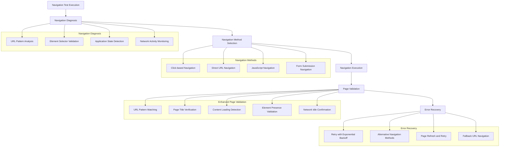

# Design Document

## Overview

The navigation test fixes design addresses critical failures in the HWPC UI testing infrastructure where navigation links are not properly navigating to their intended pages. The current issue manifests as navigation clicks that do not result in URL changes, page title updates, or page-specific content loading, causing comprehensive test failures.

The design provides a systematic approach to diagnose and fix navigation issues through enhanced debugging, improved navigation detection, fallback mechanisms, and more robust page validation. The solution maintains the existing mobile-first responsive design approach while adding reliability and error recovery capabilities.

## Architecture

### Navigation Test Fix Architecture



### Root Cause Analysis

Based on the test failure analysis, the primary issues are:

1. **Navigation Links Not Functional**: Clicking navigation links does not trigger page navigation
2. **URL Routing Issues**: The application may be using client-side routing that isn't being detected properly
3. **Page Loading Detection**: Tests are not waiting for proper page transitions to complete
4. **Selector Reliability**: Navigation selectors may not be matching actual application elements
5. **Application State Management**: The application may require specific state or authentication for navigation

## Components and Interfaces

### 1. Enhanced Navigation Diagnosis System

```typescript
interface NavigationDiagnostics {
  currentUrl: string;
  expectedUrl: string;
  navigationElementsFound: ElementDiagnostic[];
  networkActivity: NetworkActivityLog[];
  javascriptErrors: JavaScriptError[];
  applicationState: ApplicationState;
  routingType: 'server-side' | 'client-side' | 'hybrid' | 'unknown';
}

interface ElementDiagnostic {
  selector: string;
  elementName: string;
  isPresent: boolean;
  isVisible: boolean;
  isClickable: boolean;
  boundingBox: BoundingBox | null;
  attributes: Record<string, string>;
  computedStyles: Record<string, string>;
}

interface NetworkActivityLog {
  timestamp: number;
  url: string;
  method: string;
  status: number;
  responseTime: number;
  resourceType: string;
}

interface ApplicationState {
  isAuthenticated: boolean;
  currentUser: string | null;
  loadingIndicators: boolean;
  errorMessages: string[];
  consoleErrors: string[];
}
```

### 2. Multi-Strategy Navigation System

```typescript
interface NavigationStrategy {
  name: string;
  priority: number;
  execute(pageName: string, context: NavigationContext): Promise<NavigationResult>;
  canHandle(pageName: string, context: NavigationContext): Promise<boolean>;
}

class ClickNavigationStrategy implements NavigationStrategy {
  name = 'click-navigation';
  priority = 1;
  
  async execute(pageName: string, context: NavigationContext): Promise<NavigationResult> {
    // Enhanced click navigation with multiple selector attempts
    const selectors = this.getNavigationSelectors(pageName, context.viewport);
    
    for (const selector of selectors) {
      try {
        const element = await context.page.locator(selector).first();
        if (await element.isVisible() && await element.isEnabled()) {
          await element.click();
          await this.waitForNavigation(context.page, pageName);
          return { success: true, method: 'click', selector };
        }
      } catch (error) {
        console.log(`Click navigation failed for selector ${selector}: ${error.message}`);
      }
    }
    
    return { success: false, method: 'click', error: 'No clickable navigation elements found' };
  }
  
  private getNavigationSelectors(pageName: string, viewport: ViewportCategory): string[] {
    return [
      `a[href*="${pageName}"]`,
      `a[href*="/${pageName}"]`,
      `[data-nav="${pageName}"]`,
      `[data-testid="${pageName}-link"]`,
      `[data-testid="nav-${pageName}"]`,
      `.nav-${pageName}`,
      `.${pageName}-link`,
      `button[onclick*="${pageName}"]`,
      `[role="button"][data-page="${pageName}"]`
    ];
  }
}

class DirectUrlNavigationStrategy implements NavigationStrategy {
  name = 'direct-url';
  priority = 2;
  
  async execute(pageName: string, context: NavigationContext): Promise<NavigationResult> {
    try {
      const pageConfig = NavigationConstants.getPageConfig(pageName);
      if (!pageConfig) {
        return { success: false, method: 'direct-url', error: 'Page configuration not found' };
      }
      
      const fullUrl = NavigationConstants.getBaseUrl() + pageConfig.url;
      await context.page.goto(fullUrl);
      await this.waitForNavigation(context.page, pageName);
      
      return { success: true, method: 'direct-url', url: fullUrl };
    } catch (error) {
      return { success: false, method: 'direct-url', error: error.message };
    }
  }
}

class JavaScriptNavigationStrategy implements NavigationStrategy {
  name = 'javascript-navigation';
  priority = 3;
  
  async execute(pageName: string, context: NavigationContext): Promise<NavigationResult> {
    try {
      const pageConfig = NavigationConstants.getPageConfig(pageName);
      if (!pageConfig) {
        return { success: false, method: 'javascript', error: 'Page configuration not found' };
      }
      
      // Try different JavaScript navigation methods
      const navigationMethods = [
        `window.location.href = '${pageConfig.url}'`,
        `window.location.assign('${pageConfig.url}')`,
        `history.pushState(null, '', '${pageConfig.url}'); window.dispatchEvent(new PopStateEvent('popstate'))`,
        `if (window.router) { window.router.navigate('${pageConfig.url}'); }`
      ];
      
      for (const method of navigationMethods) {
        try {
          await context.page.evaluate(method);
          await this.waitForNavigation(context.page, pageName);
          
          // Verify navigation worked
          const currentUrl = context.page.url();
          if (NavigationConstants.matchesPageUrl(currentUrl, pageName)) {
            return { success: true, method: 'javascript', script: method };
          }
        } catch (error) {
          console.log(`JavaScript navigation method failed: ${method} - ${error.message}`);
        }
      }
      
      return { success: false, method: 'javascript', error: 'All JavaScript navigation methods failed' };
    } catch (error) {
      return { success: false, method: 'javascript', error: error.message };
    }
  }
}
```

### 3. Enhanced Page Validation System

```typescript
interface PageValidationConfig {
  pageName: string;
  urlPatterns: string[];
  titlePatterns: string[];
  requiredElements: ElementValidationRule[];
  contentValidators: ContentValidator[];
  timeouts: ValidationTimeouts;
}

interface ElementValidationRule {
  selector: string;
  name: string;
  required: boolean;
  mustBeVisible: boolean;
  mustBeInteractable: boolean;
  timeout: number;
}

interface ContentValidator {
  name: string;
  validate(page: Page): Promise<ValidationResult>;
}

class TicketsPageContentValidator implements ContentValidator {
  name = 'tickets-content';
  
  async validate(page: Page): Promise<ValidationResult> {
    const errors: string[] = [];
    const warnings: string[] = [];
    
    // Check for tickets-specific content
    const ticketIndicators = [
      '.tickets-container',
      '.ticket-list',
      '[data-testid="tickets-page"]',
      'h1:has-text("Tickets")',
      'h2:has-text("Tickets")',
      '.page-title:has-text("Tickets")'
    ];
    
    let foundIndicator = false;
    for (const indicator of ticketIndicators) {
      try {
        const element = page.locator(indicator).first();
        if (await element.isVisible({ timeout: 2000 })) {
          foundIndicator = true;
          break;
        }
      } catch (error) {
        // Continue checking other indicators
      }
    }
    
    if (!foundIndicator) {
      errors.push('No tickets-specific content indicators found');
    }
    
    // Check for navigation away from dashboard
    const dashboardIndicators = [
      'h1:has-text("Dashboard")',
      '.dashboard-container',
      '[data-testid="dashboard-page"]'
    ];
    
    for (const indicator of dashboardIndicators) {
      try {
        const element = page.locator(indicator).first();
        if (await element.isVisible({ timeout: 1000 })) {
          errors.push('Still showing dashboard content - navigation may have failed');
          break;
        }
      } catch (error) {
        // Dashboard indicator not found - this is good
      }
    }
    
    return {
      isValid: errors.length === 0,
      errors,
      warnings,
      timestamp: new Date().toISOString()
    };
  }
}
```

### 4. Navigation Context and State Management

```typescript
interface NavigationContext {
  page: Page;
  viewport: ViewportCategory;
  currentUrl: string;
  previousUrl: string;
  userAgent: string;
  sessionState: SessionState;
  applicationState: ApplicationState;
  networkConditions: NetworkConditions;
}

interface SessionState {
  isAuthenticated: boolean;
  userId: string | null;
  sessionToken: string | null;
  permissions: string[];
  lastActivity: Date;
}

interface NetworkConditions {
  isOnline: boolean;
  connectionType: string;
  effectiveType: string;
  downlink: number;
  rtt: number;
}

class NavigationContextManager {
  private context: NavigationContext;
  
  constructor(page: Page) {
    this.context = {
      page,
      viewport: this.detectViewport(page),
      currentUrl: page.url(),
      previousUrl: '',
      userAgent: '',
      sessionState: this.detectSessionState(page),
      applicationState: this.detectApplicationState(page),
      networkConditions: this.detectNetworkConditions(page)
    };
  }
  
  async updateContext(): Promise<void> {
    this.context.previousUrl = this.context.currentUrl;
    this.context.currentUrl = this.context.page.url();
    this.context.applicationState = await this.detectApplicationState(this.context.page);
  }
  
  private async detectSessionState(page: Page): Promise<SessionState> {
    try {
      const sessionData = await page.evaluate(() => {
        return {
          isAuthenticated: !!localStorage.getItem('auth_user') || !!document.cookie.includes('mvp_session'),
          userId: localStorage.getItem('user_id'),
          sessionToken: localStorage.getItem('session_token'),
          permissions: JSON.parse(localStorage.getItem('user_permissions') || '[]')
        };
      });
      
      return {
        ...sessionData,
        lastActivity: new Date()
      };
    } catch (error) {
      return {
        isAuthenticated: false,
        userId: null,
        sessionToken: null,
        permissions: [],
        lastActivity: new Date()
      };
    }
  }
}
```

### 5. Error Recovery and Retry System

```typescript
interface RetryConfig {
  maxAttempts: number;
  baseDelay: number;
  maxDelay: number;
  backoffFactor: number;
  retryConditions: RetryCondition[];
}

interface RetryCondition {
  name: string;
  shouldRetry(error: Error, attempt: number, context: NavigationContext): boolean;
}

class NavigationTimeoutRetryCondition implements RetryCondition {
  name = 'navigation-timeout';
  
  shouldRetry(error: Error, attempt: number, context: NavigationContext): boolean {
    return error.message.includes('timeout') && attempt < 3;
  }
}

class ElementNotFoundRetryCondition implements RetryCondition {
  name = 'element-not-found';
  
  shouldRetry(error: Error, attempt: number, context: NavigationContext): boolean {
    return error.message.includes('not found') && attempt < 2;
  }
}

class NavigationRetryManager {
  private config: RetryConfig;
  
  constructor(config: RetryConfig) {
    this.config = config;
  }
  
  async executeWithRetry<T>(
    operation: () => Promise<T>,
    context: NavigationContext,
    operationName: string
  ): Promise<T> {
    let lastError: Error;
    
    for (let attempt = 1; attempt <= this.config.maxAttempts; attempt++) {
      try {
        console.log(`${operationName} attempt ${attempt}/${this.config.maxAttempts}`);
        return await operation();
      } catch (error) {
        lastError = error;
        console.log(`${operationName} attempt ${attempt} failed: ${error.message}`);
        
        // Check if we should retry
        const shouldRetry = this.config.retryConditions.some(condition => 
          condition.shouldRetry(error, attempt, context)
        );
        
        if (!shouldRetry || attempt === this.config.maxAttempts) {
          break;
        }
        
        // Calculate delay with exponential backoff
        const delay = Math.min(
          this.config.baseDelay * Math.pow(this.config.backoffFactor, attempt - 1),
          this.config.maxDelay
        );
        
        console.log(`Waiting ${delay}ms before retry...`);
        await new Promise(resolve => setTimeout(resolve, delay));
      }
    }
    
    throw new Error(`${operationName} failed after ${this.config.maxAttempts} attempts. Last error: ${lastError.message}`);
  }
}
```

## Data Models

### Navigation Test Configuration

```typescript
interface NavigationTestConfig {
  pages: PageTestConfig[];
  strategies: NavigationStrategyConfig[];
  validation: ValidationConfig;
  retry: RetryConfig;
  debugging: DebuggingConfig;
}

interface PageTestConfig {
  name: string;
  url: string;
  title: string;
  selectors: PageSelectors;
  validation: PageValidationConfig;
  fallbackUrls: string[];
  requiredState: RequiredState;
}

interface PageSelectors {
  navigation: string[];
  pageIdentifier: string[];
  requiredElements: string[];
  searchInterface: string[];
  loadingIndicators: string[];
}

interface RequiredState {
  authentication: boolean;
  permissions: string[];
  sessionData: Record<string, any>;
}

interface DebuggingConfig {
  captureScreenshots: boolean;
  captureNetworkLogs: boolean;
  captureConsoleErrors: boolean;
  capturePageSource: boolean;
  verboseLogging: boolean;
}
```

### Enhanced Navigation Constants

```typescript
class EnhancedNavigationConstants extends NavigationConstants {
  // Enhanced page configurations with multiple selector strategies
  private static readonly ENHANCED_PAGES: Record<string, EnhancedPageConfig> = {
    tickets: {
      name: 'tickets',
      urls: ['/tickets', '/ticket', '/tickets.html', '?page=tickets'],
      titles: ['Tickets', 'Ticket Management', 'Static Site - API Testing'],
      selectors: {
        navigation: [
          'a[href*="tickets"]',
          'a[href*="/tickets"]',
          '[data-nav="tickets"]',
          '[data-testid="tickets-link"]',
          '.nav-tickets',
          '.tickets-link',
          'button[onclick*="tickets"]'
        ],
        pageIdentifier: [
          '.tickets-page',
          '.tickets-container',
          '[data-testid="tickets-page"]',
          'h1:has-text("Tickets")',
          '.page-title:has-text("Tickets")'
        ],
        requiredElements: [
          '.main-content',
          '.container',
          'body'
        ],
        searchInterface: [
          '.ticket-search',
          '.search-container',
          '[data-search]',
          '[data-testid="ticket-search"]',
          'input[type="search"]'
        ]
      },
      validation: {
        urlMustChange: true,
        titleMustChange: true,
        contentMustLoad: true,
        timeoutMs: 10000
      }
    }
    // ... other pages
  };
  
  static getEnhancedPageConfig(pageName: string): EnhancedPageConfig | undefined {
    return this.ENHANCED_PAGES[pageName.toLowerCase()];
  }
}
```

## Error Handling

### Comprehensive Error Classification

```typescript
enum NavigationErrorType {
  ELEMENT_NOT_FOUND = 'element-not-found',
  ELEMENT_NOT_CLICKABLE = 'element-not-clickable',
  NAVIGATION_TIMEOUT = 'navigation-timeout',
  URL_NOT_CHANGED = 'url-not-changed',
  TITLE_NOT_CHANGED = 'title-not-changed',
  CONTENT_NOT_LOADED = 'content-not-loaded',
  NETWORK_ERROR = 'network-error',
  JAVASCRIPT_ERROR = 'javascript-error',
  AUTHENTICATION_ERROR = 'authentication-error',
  UNKNOWN_ERROR = 'unknown-error'
}

class NavigationErrorHandler {
  static async handleError(
    error: Error,
    context: NavigationContext,
    pageName: string
  ): Promise<NavigationErrorInfo> {
    const errorInfo: NavigationErrorInfo = {
      type: this.classifyError(error),
      message: error.message,
      pageName,
      context: {
        currentUrl: context.currentUrl,
        viewport: context.viewport,
        timestamp: new Date().toISOString()
      },
      debugging: await this.captureDebuggingInfo(context),
      suggestions: this.getSuggestions(error, context, pageName)
    };
    
    // Log comprehensive error information
    console.error('Navigation Error Details:', JSON.stringify(errorInfo, null, 2));
    
    return errorInfo;
  }
  
  private static classifyError(error: Error): NavigationErrorType {
    const message = error.message.toLowerCase();
    
    if (message.includes('not found') || message.includes('no such element')) {
      return NavigationErrorType.ELEMENT_NOT_FOUND;
    }
    if (message.includes('not clickable') || message.includes('not interactable')) {
      return NavigationErrorType.ELEMENT_NOT_CLICKABLE;
    }
    if (message.includes('timeout')) {
      return NavigationErrorType.NAVIGATION_TIMEOUT;
    }
    if (message.includes('url') && message.includes('not')) {
      return NavigationErrorType.URL_NOT_CHANGED;
    }
    if (message.includes('title') && message.includes('not')) {
      return NavigationErrorType.TITLE_NOT_CHANGED;
    }
    if (message.includes('content') && message.includes('not loaded')) {
      return NavigationErrorType.CONTENT_NOT_LOADED;
    }
    if (message.includes('network') || message.includes('connection')) {
      return NavigationErrorType.NETWORK_ERROR;
    }
    if (message.includes('javascript') || message.includes('script error')) {
      return NavigationErrorType.JAVASCRIPT_ERROR;
    }
    if (message.includes('auth') || message.includes('permission')) {
      return NavigationErrorType.AUTHENTICATION_ERROR;
    }
    
    return NavigationErrorType.UNKNOWN_ERROR;
  }
  
  private static getSuggestions(
    error: Error,
    context: NavigationContext,
    pageName: string
  ): string[] {
    const suggestions: string[] = [];
    const errorType = this.classifyError(error);
    
    switch (errorType) {
      case NavigationErrorType.ELEMENT_NOT_FOUND:
        suggestions.push('Check if navigation selectors match actual application elements');
        suggestions.push('Verify the page has loaded completely before attempting navigation');
        suggestions.push('Try using alternative navigation selectors');
        break;
        
      case NavigationErrorType.URL_NOT_CHANGED:
        suggestions.push('Check if the application uses client-side routing');
        suggestions.push('Verify navigation links are functional in the application');
        suggestions.push('Try direct URL navigation as fallback');
        break;
        
      case NavigationErrorType.NAVIGATION_TIMEOUT:
        suggestions.push('Increase timeout values for slow network conditions');
        suggestions.push('Check for loading indicators that may be blocking navigation');
        suggestions.push('Verify network connectivity and application responsiveness');
        break;
        
      case NavigationErrorType.AUTHENTICATION_ERROR:
        suggestions.push('Verify mock authentication is properly set up');
        suggestions.push('Check if the page requires specific user permissions');
        suggestions.push('Ensure session state is maintained during navigation');
        break;
    }
    
    return suggestions;
  }
}
```

## Testing Strategy

### Multi-Level Navigation Testing

1. **Diagnostic Level**: Comprehensive analysis of navigation elements and application state
2. **Strategy Level**: Multiple navigation approaches with automatic fallback
3. **Validation Level**: Enhanced page validation with content-specific checks
4. **Recovery Level**: Intelligent retry mechanisms with error classification

### Implementation Phases

#### Phase 1: Enhanced Diagnostics
- Implement comprehensive navigation element detection
- Add network activity monitoring
- Create application state analysis
- Build error classification system

#### Phase 2: Multi-Strategy Navigation
- Implement click-based navigation with multiple selectors
- Add direct URL navigation fallback
- Create JavaScript-based navigation options
- Build strategy selection logic

#### Phase 3: Robust Validation
- Enhance page validation with content-specific checks
- Implement timeout management
- Add performance monitoring
- Create validation result reporting

#### Phase 4: Error Recovery
- Implement retry mechanisms with exponential backoff
- Add automatic fallback strategy selection
- Create comprehensive error reporting
- Build debugging artifact capture

## Performance Considerations

### Navigation Performance Optimization

1. **Parallel Validation**: Run multiple validation checks concurrently
2. **Smart Timeouts**: Adaptive timeout values based on network conditions
3. **Caching**: Cache navigation selectors and page configurations
4. **Lazy Loading**: Load debugging information only when needed

### Resource Management

1. **Memory Management**: Clean up event listeners and observers
2. **Network Optimization**: Minimize unnecessary network requests during validation
3. **Screenshot Optimization**: Capture screenshots only on failures
4. **Log Management**: Implement log rotation and cleanup

This design provides a comprehensive solution to the navigation test failures while maintaining the existing mobile-first approach and adding robust error handling and recovery mechanisms.