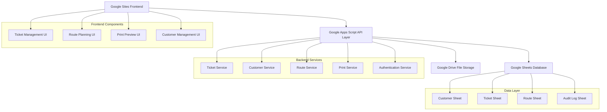
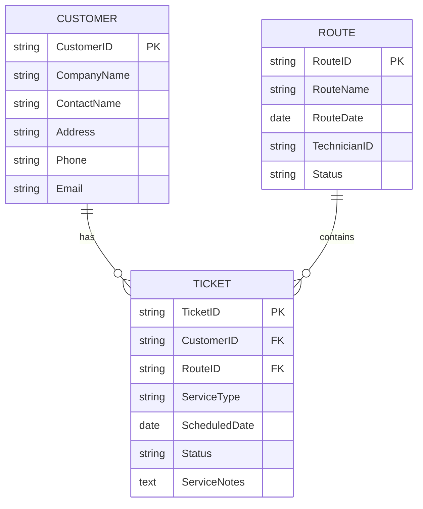

# Design Document

## Overview

The pest control route management system will be architected as a modern web application using Google Sites as the presentation layer and Google Sheets as the data persistence layer. The system follows a mobile-first design philosophy, ensuring optimal performance and usability on mobile devices while maintaining desktop compatibility.

The architecture leverages Google Apps Script as the middleware layer to handle business logic, data validation, and integration between the front-end and Google Sheets backend. This approach provides seamless integration with Google Workspace while maintaining the familiar functionality of the legacy Delphi system.

## Architecture

### System Architecture Diagram



### Technology Stack

- **Frontend**: Google Sites with embedded HTML/CSS/JavaScript
- **Middleware**: Google Apps Script (JavaScript runtime)
- **Backend**: Google Sheets (structured data storage)
- **Authentication**: Google Workspace OAuth
- **File Storage**: Google Drive (for exports and attachments)
- **Mobile Framework**: Progressive Web App (PWA) capabilities

## Components and Interfaces

### Frontend Components

#### 1. Ticket Management Interface (TicketView Modernization)

**Mobile-First Design Principles:**
- Card-based layout for ticket display
- Touch-friendly buttons and form controls
- Swipe gestures for navigation
- Collapsible sections for detailed information

**Key Features:**
- Responsive grid layout adapting to screen size
- Search and filter functionality with mobile-optimized controls
- Modal dialogs for create/edit operations
- Real-time status updates with visual indicators

#### 2. Route Planning Interface

**Design Approach:**
- Drag-and-drop interface with touch support
- Map integration for visual route planning
- List view with sortable ticket assignments
- Route optimization suggestions

**Mobile Considerations:**
- Touch-based ticket assignment
- Simplified map controls for mobile interaction
- Collapsible route details
- Quick action buttons for common operations

#### 3. Print Preview Interface (RoutePrint Modernization)

**Based on Legacy UI Reference:**
The original Delphi interface (https://github.com/2cld/HWPCold/blob/master/HWPC_DelphiProg/HWPC_Program_TicketPreview.JPG) shows a structured layout with:
- Header section with route information
- Tabular display of customer stops
- Service details and notes
- Footer with totals and summary

**Modern Implementation:**
- Responsive print layout that adapts to mobile screens
- CSS print media queries for optimal printing
- PDF generation capability for mobile sharing
- Maintain visual hierarchy from original design
- Touch-friendly preview controls

#### 4. Customer Management Interface

**Design Features:**
- Searchable customer directory
- Quick-add customer functionality
- Customer history timeline
- Contact information management

### Backend Services (Google Apps Script)

#### 1. Data Access Layer

```javascript
// Service interface pattern
class CustomerService {
  static getAll()
  static getById(id)
  static create(customerData)
  static update(id, customerData)
  static delete(id)
  static search(criteria)
}

class TicketService {
  static getAll()
  static getByCustomer(customerId)
  static getByRoute(routeId)
  static create(ticketData)
  static update(id, ticketData)
  static updateStatus(id, status)
  static delete(id)
}

class RouteService {
  static getAll()
  static getById(id)
  static create(routeData)
  static addTicket(routeId, ticketId)
  static removeTicket(routeId, ticketId)
  static optimizeRoute(routeId)
  static generatePrintData(routeId)
}
```

#### 2. Authentication and Security Service

```javascript
class AuthService {
  static getCurrentUser()
  static hasPermission(action, resource)
  static logActivity(action, details)
  static validateSession()
}
```

## Data Models

### Google Sheets Schema

#### Customer Sheet (CustomerDB Equivalent)
```
Column A: CustomerID (Auto-generated)
Column B: CompanyName
Column C: ContactName
Column D: Address
Column E: City
Column F: State
Column G: ZipCode
Column H: Phone
Column I: Email
Column J: ServiceType
Column K: SpecialInstructions
Column L: CreatedDate
Column M: ModifiedDate
Column N: Active (Boolean)
```

#### Ticket Sheet (TicketDB Equivalent)
```
Column A: TicketID (Auto-generated)
Column B: CustomerID (Foreign Key)
Column C: ServiceType
Column D: ScheduledDate
Column E: ScheduledTime
Column F: Priority (High/Medium/Low)
Column G: Status (Pending/Assigned/Completed/Cancelled)
Column H: RouteID (Foreign Key)
Column I: ServiceNotes
Column J: CompletionNotes
Column K: TechnicianID
Column L: EstimatedDuration
Column M: ActualDuration
Column N: CreatedDate
Column O: ModifiedDate
Column P: CompletedDate
```

#### Route Sheet
```
Column A: RouteID (Auto-generated)
Column B: RouteName
Column C: RouteDate
Column D: TechnicianID
Column E: Status (Draft/Active/Completed)
Column F: EstimatedTime
Column G: ActualTime
Column H: CreatedDate
Column I: ModifiedDate
Column J: Notes
```

#### Audit Log Sheet
```
Column A: LogID (Auto-generated)
Column B: UserID
Column C: Action
Column D: ResourceType
Column E: ResourceID
Column F: OldValue
Column G: NewValue
Column H: Timestamp
Column I: IPAddress
```

### Data Relationships



## Error Handling

### Client-Side Error Handling

1. **Network Connectivity**
   - Detect offline status
   - Queue operations for sync when online
   - Display appropriate user feedback

2. **Validation Errors**
   - Real-time form validation
   - Clear error messaging
   - Field-level error indicators

3. **API Errors**
   - Graceful degradation
   - Retry mechanisms
   - User-friendly error messages

### Server-Side Error Handling

1. **Google Sheets API Limits**
   - Rate limiting implementation
   - Batch operations optimization
   - Error logging and monitoring

2. **Data Integrity**
   - Transaction-like operations
   - Rollback capabilities
   - Conflict resolution

3. **Authentication Errors**
   - Session timeout handling
   - Permission validation
   - Secure error responses

## Testing Strategy

### Unit Testing
- Google Apps Script functions testing
- Data validation logic testing
- Business rule enforcement testing

### Integration Testing
- Google Sheets API integration
- Google Sites embedding
- Cross-browser compatibility

### Mobile Testing
- Responsive design validation
- Touch interaction testing
- Performance on mobile networks
- Print functionality on mobile devices

### User Acceptance Testing
- Legacy system comparison
- Workflow validation
- Performance benchmarking
- Mobile usability testing

### Test Data Strategy
- Sanitized production data migration
- Synthetic test data generation
- Edge case scenario testing
- Load testing with realistic data volumes

## Performance Considerations

### Mobile Optimization
- Lazy loading of ticket data
- Compressed image assets
- Minimal JavaScript payload
- Efficient CSS for mobile rendering

### Google Sheets Optimization
- Batch read/write operations
- Indexed columns for faster queries
- Data pagination for large datasets
- Caching strategies for frequently accessed data

### Network Optimization
- Progressive loading
- Offline capability with service workers
- Data compression
- Minimal API calls

## Security Implementation

### Authentication Flow
1. Google Workspace OAuth integration
2. Session management
3. Role-based access control
4. Activity logging

### Data Protection
- HTTPS enforcement
- Input sanitization
- SQL injection prevention (Sheets queries)
- XSS protection

### Privacy Compliance
- Customer data encryption
- Access audit trails
- Data retention policies
- GDPR compliance considerations

## Migration Strategy

### Phase 1: Data Migration
1. Export CustomerDB and TicketDB from Delphi system
2. Transform data to Google Sheets format
3. Validate data integrity
4. Import historical data

### Phase 2: Parallel Operation
1. Run both systems simultaneously
2. Sync critical data between systems
3. Train users on new interface
4. Validate business processes

### Phase 3: Full Cutover
1. Final data synchronization
2. Decommission legacy system
3. Monitor system performance
4. Address any issues

## Deployment Architecture

### Google Sites Structure
```
/pest-control-system/
├── /tickets/          # Ticket management pages
├── /routes/           # Route planning pages
├── /customers/        # Customer management pages
├── /reports/          # Reporting and analytics
├── /admin/            # Administrative functions
└── /assets/           # Shared CSS, JS, images
```

### Apps Script Project Structure
```
/src/
├── /services/         # Business logic services
├── /models/           # Data models and validation
├── /utils/            # Utility functions
├── /api/              # API endpoints
└── /triggers/         # Event handlers
```

This design maintains the core functionality of your legacy Delphi system while modernizing it for mobile-first usage and Google Workspace integration. The architecture is scalable, maintainable, and provides a solid foundation for future enhancements.