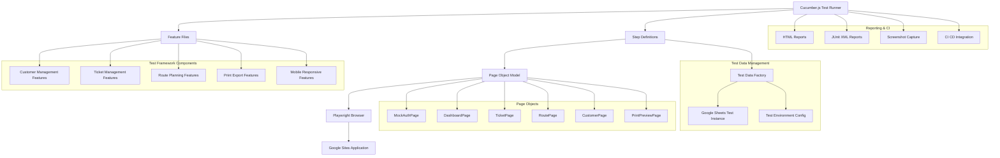

# Design Document

## Overview

The UI testing infrastructure will provide comprehensive end-to-end testing capabilities for the pest control route management system using cucumber.js and Playwright. The design leverages the existing Gherkin-like structure of the pest control requirements to create maintainable, behavior-driven tests that validate the entire user workflow from Google Sites frontend through Google Apps Script middleware to Google Sheets backend.

The testing framework follows modern testing practices including the Page Object Model, data-driven testing, and CI/CD integration while specifically addressing the unique challenges of testing Google Workspace applications with embedded iframes. For MVP development, authentication is handled through a mock user system to avoid login/encryption complexities during core workflow development.

## Architecture

### Testing Architecture Diagram



### Technology Stack

- **Test Framework**: Cucumber.js (Gherkin BDD)
- **Browser Automation**: Playwright (Chrome, Firefox, Safari)
- **Test Runner**: Node.js with npm scripts
- **Page Object Framework**: Custom implementation with Playwright
- **Test Data**: JSON fixtures and Google Sheets API
- **Reporting**: Cucumber HTML Reporter, Allure Reports
- **CI/CD**: GitHub Actions / Jenkins compatible
- **Mobile Testing**: Playwright Device Emulation

## Components and Interfaces

### 1. Feature Files Structure

Based on the existing pest control requirements, feature files will mirror the requirement structure:

```
features/
├── customer-management.feature          # Requirement 1
├── ticket-management.feature            # Requirement 2
├── route-planning.feature              # Requirement 3
├── route-printing.feature              # Requirement 4
├── mobile-experience.feature           # Requirement 5
├── google-workspace-integration.feature # Requirement 6
├── data-migration.feature              # Requirement 7
└── security-access-control.feature     # Requirement 8
```

#### Example Feature File (ticket-management.feature)

```gherkin
Feature: Ticket Management System
  As a pest control service specialist
  I want to create, view, update, and delete service tickets
  So that I can track all service requests and their completion status

  Background:
    Given I am authenticated as MVP user "usermvp@hwpc.net"
    And I have access to the ticket management interface

  @mobile @crud
  Scenario: Create a new service ticket
    Given I am on the ticket management page
    When I click the "Create New Ticket" button
    And I select customer "ABC Pest Control Inc"
    And I select service type "Monthly Treatment"
    And I set the scheduled date to "2024-03-15"
    And I set the priority to "High"
    And I click "Save Ticket"
    Then the ticket should be created successfully
    And the ticket should appear in the ticket list
    And the ticket status should be "Pending"
    And the Google Sheets backend should contain the new ticket data

  @mobile @responsive
  Scenario: View ticket details on mobile device
    Given I have a ticket with ID "TKT-001" in the system
    And I am using a mobile device with screen size "375x667"
    When I navigate to the ticket management page
    And I tap on ticket "TKT-001"
    Then the ticket details should display in a mobile-optimized format
    And all ticket information should be visible and readable
    And the interface should be touch-friendly
```

### 2. Step Definitions Architecture

```javascript
// step-definitions/ticket-management-steps.js
const { Given, When, Then } = require('@cucumber/cucumber');
const { TicketPage } = require('../page-objects/TicketPage');
const { DashboardPage } = require('../page-objects/DashboardPage');
const { TestDataFactory } = require('../support/TestDataFactory');

// Page object instances
let ticketPage;
let dashboardPage;

Given('I am on the ticket management page', async function () {
  ticketPage = new TicketPage(this.driver);
  await ticketPage.navigate();
  await ticketPage.waitForPageLoad();
});

When('I click the {string} button', async function (buttonText) {
  await ticketPage.clickButton(buttonText);
});

When('I select customer {string}', async function (customerName) {
  await ticketPage.selectCustomer(customerName);
});

Then('the ticket should be created successfully', async function () {
  const successMessage = await ticketPage.getSuccessMessage();
  expect(successMessage).to.contain('Ticket created successfully');
});

Then('the Google Sheets backend should contain the new ticket data', async function () {
  const ticketData = await TestDataFactory.getLatestTicketFromSheets();
  expect(ticketData).to.not.be.null;
  expect(ticketData.status).to.equal('Pending');
});
```

### 3. Page Object Model Implementation

#### Base Page Object

```javascript
// page-objects/BasePage.js
class BasePage {
  constructor(page) {
    this.page = page;
    this.timeout = 10000;
  }

  async navigate(url) {
    await this.page.goto(url);
  }

  async waitForElement(selector, timeout = this.timeout) {
    return await this.page.waitForSelector(selector, { timeout });
  }

  async clickElement(selector) {
    await this.page.click(selector);
  }

  async enterText(selector, text) {
    await this.page.fill(selector, text);
  }

  async getText(selector) {
    return await this.page.textContent(selector);
  }

  // Handle Google Sites iframe navigation
  async switchToGoogleSitesFrame() {
    const frames = await this.page.frames();
    for (let frame of frames) {
      try {
        // Check if this is the correct frame by looking for app-specific elements
        const appElements = await frame.$$('[data-app="pest-control"]');
        if (appElements.length > 0) {
          this.page = frame;
          return true;
        }
      } catch (e) {
        // Continue to next frame
      }
    }
    return false;
  }

  async takeScreenshot(filename) {
    await this.page.screenshot({ path: `screenshots/${filename}` });
  }
}

module.exports = { BasePage };
```

#### Ticket Page Object

```javascript
// page-objects/TicketPage.js
const { By } = require('selenium-webdriver');
const { BasePage } = require('./BasePage');

class TicketPage extends BasePage {
  constructor(driver) {
    super(driver);
    this.url = process.env.BASE_URL + '?page=tickets';
    
    // Locators
    this.locators = {
      createTicketButton: By.css('[data-testid="create-ticket-btn"]'),
      customerDropdown: By.css('[data-testid="customer-select"]'),
      serviceTypeDropdown: By.css('[data-testid="service-type-select"]'),
      scheduledDateInput: By.css('[data-testid="scheduled-date"]'),
      priorityDropdown: By.css('[data-testid="priority-select"]'),
      saveButton: By.css('[data-testid="save-ticket-btn"]'),
      successMessage: By.css('[data-testid="success-message"]'),
      ticketList: By.css('[data-testid="ticket-list"]'),
      ticketItem: (ticketId) => By.css(`[data-testid="ticket-${ticketId}"]`)
    };
  }

  async navigate() {
    await super.navigate(this.url);
    await this.switchToGoogleSitesFrame();
  }

  async waitForPageLoad() {
    await this.waitForElement(this.locators.createTicketButton);
  }

  async clickButton(buttonText) {
    switch (buttonText.toLowerCase()) {
      case 'create new ticket':
        await this.clickElement(this.locators.createTicketButton);
        break;
      case 'save ticket':
        await this.clickElement(this.locators.saveButton);
        break;
      default:
        throw new Error(`Unknown button: ${buttonText}`);
    }
  }

  async selectCustomer(customerName) {
    await this.clickElement(this.locators.customerDropdown);
    const customerOption = By.css(`[data-testid="customer-option"][data-value="${customerName}"]`);
    await this.clickElement(customerOption);
  }

  async selectServiceType(serviceType) {
    await this.clickElement(this.locators.serviceTypeDropdown);
    const serviceOption = By.css(`[data-testid="service-option"][data-value="${serviceType}"]`);
    await this.clickElement(serviceOption);
  }

  async setScheduledDate(date) {
    await this.enterText(this.locators.scheduledDateInput, date);
  }

  async setPriority(priority) {
    await this.clickElement(this.locators.priorityDropdown);
    const priorityOption = By.css(`[data-testid="priority-option"][data-value="${priority}"]`);
    await this.clickElement(priorityOption);
  }

  async getSuccessMessage() {
    return await this.getText(this.locators.successMessage);
  }

  async isTicketInList(ticketId) {
    try {
      await this.waitForElement(this.locators.ticketItem(ticketId), 5000);
      return true;
    } catch (e) {
      return false;
    }
  }

  // Mobile-specific methods
  async tapTicket(ticketId) {
    const ticketElement = await this.waitForElement(this.locators.ticketItem(ticketId));
    // Use touch action for mobile testing
    await this.driver.executeScript('arguments[0].click();', ticketElement);
  }
}

module.exports = { TicketPage };
```

### 4. MVP Mock Authentication System

```javascript
// support/MockAuthManager.js
class MockAuthManager {
  constructor() {
    this.mockUser = {
      email: 'usermvp@hwpc.net',
      name: 'MVP Test User',
      id: 'mvp-user-001',
      permissions: ['read', 'write', 'delete'],
      sessionId: 'mvp-session-' + Date.now()
    };
  }

  async authenticateAsMVPUser(page) {
    // Set mock authentication cookies/localStorage
    await page.addInitScript(() => {
      localStorage.setItem('auth_user', JSON.stringify({
        email: 'usermvp@hwpc.net',
        name: 'MVP Test User',
        id: 'mvp-user-001',
        authenticated: true,
        sessionId: 'mvp-session-' + Date.now()
      }));
      
      // Set session cookie
      document.cookie = 'mvp_session=authenticated; path=/';
    });
  }

  async setMockUserContext(page) {
    // Inject mock user context into the page
    await page.evaluate((user) => {
      window.currentUser = user;
      window.isAuthenticated = true;
    }, this.mockUser);
  }

  getMockUser() {
    return this.mockUser;
  }

  async clearMockAuth(page) {
    await page.evaluate(() => {
      localStorage.removeItem('auth_user');
      document.cookie = 'mvp_session=; expires=Thu, 01 Jan 1970 00:00:00 UTC; path=/;';
      delete window.currentUser;
      window.isAuthenticated = false;
    });
  }
}

module.exports = { MockAuthManager };
```

### 5. Test Data Management

```javascript
// support/TestDataFactory.js
const { GoogleSheetsAPI } = require('./GoogleSheetsAPI');
const { MockAuthManager } = require('./MockAuthManager');

class TestDataFactory {
  static async createTestCustomer(customerData = {}) {
    const mockAuth = new MockAuthManager();
    const defaultCustomer = {
      companyName: 'Test Company ' + Date.now(),
      contactName: 'Test Contact',
      address: '123 Test Street',
      city: 'Test City',
      state: 'TS',
      zipCode: '12345',
      phone: '555-0123',
      email: 'test@example.com',
      serviceType: 'Monthly Treatment',
      specialInstructions: 'Test customer - safe to delete',
      active: true,
      createdBy: mockAuth.getMockUser().email,
      mvpTestData: true
    };

    const customer = { ...defaultCustomer, ...customerData };
    const customerId = await GoogleSheetsAPI.createCustomer(customer);
    return { ...customer, customerId };
  }

  static async createTestTicket(ticketData = {}) {
    const customer = await this.createTestCustomer();
    
    const mockAuth = new MockAuthManager();
    const defaultTicket = {
      customerId: customer.customerId,
      serviceType: 'Monthly Treatment',
      scheduledDate: new Date(Date.now() + 7 * 24 * 60 * 60 * 1000), // 7 days from now
      scheduledTime: '09:00',
      priority: 'Medium',
      status: 'Pending',
      serviceNotes: 'Test ticket - safe to delete',
      estimatedDuration: 60,
      createdBy: mockAuth.getMockUser().email,
      mvpTestData: true
    };

    const ticket = { ...defaultTicket, ...ticketData };
    const ticketId = await GoogleSheetsAPI.createTicket(ticket);
    return { ...ticket, ticketId, customer };
  }

  static async cleanupTestData() {
    // Remove all test data created during test runs
    await GoogleSheetsAPI.deleteTestCustomers();
    await GoogleSheetsAPI.deleteTestTickets();
    await GoogleSheetsAPI.deleteTestRoutes();
  }

  static async getLatestTicketFromSheets() {
    return await GoogleSheetsAPI.getLatestTicket();
  }
}

module.exports = { TestDataFactory };
```

### 6. Playwright Browser Configuration

```javascript
// support/BrowserManager.js
const { chromium, firefox, webkit } = require('playwright');

class BrowserManager {
  static async createBrowser(options = {}) {
    const browserType = options.browser || 'chromium';
    
    const launchOptions = {
      headless: process.env.HEADLESS === 'true' || process.env.CI === 'true',
      args: [
        '--no-sandbox',
        '--disable-dev-shm-usage',
        '--disable-gpu'
      ]
    };

    let browser;
    switch (browserType) {
      case 'firefox':
        browser = await firefox.launch(launchOptions);
        break;
      case 'webkit':
        browser = await webkit.launch(launchOptions);
        break;
      default:
        browser = await chromium.launch(launchOptions);
    }

    const context = await browser.newContext({
      viewport: options.viewport || { width: 1920, height: 1080 },
      // Mobile device emulation
      ...(options.mobileDevice && { 
        ...require('playwright').devices[options.mobileDevice] 
      })
    });

    const page = await context.newPage();
    return { browser, context, page };
  }

  static async closeBrowser(browser) {
    if (browser) {
      await browser.close();
    }
  }
}

module.exports = { BrowserManager };
```

## Data Models

### Test Configuration Schema

```javascript
// config/test-config.js
module.exports = {
  // Environment configuration
  environments: {
    development: {
      baseUrl: 'https://script.google.com/macros/s/YOUR_SCRIPT_ID/exec',
      sheetsId: 'YOUR_TEST_SHEETS_ID',
      timeout: 10000
    },
    staging: {
      baseUrl: 'https://sites.google.com/view/pest-control-staging',
      sheetsId: 'YOUR_STAGING_SHEETS_ID',
      timeout: 15000
    }
  },

  // Browser configuration
  browsers: {
    chrome: {
      headless: process.env.HEADLESS === 'true',
      windowSize: '1920,1080',
      mobileDevices: ['iPhone X', 'iPad', 'Pixel 2']
    }
  },

  // Test data configuration
  testData: {
    cleanupAfterTests: true,
    useRealGoogleSheets: true,
    testDataPrefix: 'TEST_'
  },

  // Reporting configuration
  reporting: {
    htmlReports: true,
    junitReports: true,
    screenshots: true,
    screenshotOnFailure: true
  }
};
```

### Google Sheets Test Data Schema

```javascript
// Test data will mirror production schema but with test prefixes and MVP user identification
const TEST_CUSTOMER_SCHEMA = {
  customerId: 'TEST_CUST_' + timestamp,
  companyName: 'TEST_' + companyName,
  // ... other fields
  testFlag: true,
  createdByTest: true,
  createdBy: 'usermvp@hwpc.net',
  mvpTestData: true
};

const TEST_TICKET_SCHEMA = {
  ticketId: 'TEST_TKT_' + timestamp,
  customerId: 'TEST_CUST_' + customerId,
  // ... other fields
  testFlag: true,
  createdByTest: true,
  createdBy: 'usermvp@hwpc.net',
  mvpTestData: true
};
```

## Error Handling

### Test Execution Error Handling

1. **Playwright Browser Errors**
   - Element not found: Retry with exponential backoff
   - Timeout errors: Capture screenshot and page source
   - Browser crashes: Restart browser and retry test

2. **Google Workspace Integration Errors**
   - Authentication failures: Refresh tokens and retry
   - API rate limiting: Implement backoff strategy
   - Iframe navigation issues: Multiple frame detection strategies

3. **Test Data Errors**
   - Google Sheets API failures: Fallback to mock data
   - Data cleanup failures: Log and continue with warnings
   - Concurrent test data conflicts: Use unique identifiers

### Reporting and Debugging

```javascript
// support/ErrorHandler.js
class ErrorHandler {
  static async handleTestFailure(scenario, page) {
    const timestamp = new Date().toISOString().replace(/[:.]/g, '-');
    const screenshotName = `failure-${scenario.pickle.name}-${timestamp}.png`;
    
    try {
      // Capture screenshot
      await page.screenshot({ path: `screenshots/${screenshotName}` });

      // Capture page source
      const pageSource = await page.content();
      require('fs').writeFileSync(`logs/page-source-${timestamp}.html`, pageSource);

      // Capture console logs (collected during test execution)
      const logs = this.consoleLogs || [];
      require('fs').writeFileSync(`logs/console-${timestamp}.json`, JSON.stringify(logs, null, 2));

    } catch (captureError) {
      console.error('Failed to capture failure artifacts:', captureError);
    }
  }

  static logTestStep(stepName, status, details = {}) {
    const logEntry = {
      timestamp: new Date().toISOString(),
      step: stepName,
      status: status,
      details: details
    };
    
    console.log(JSON.stringify(logEntry));
  }
}

module.exports = { ErrorHandler };
```

## Testing Strategy

### Test Execution Levels

1. **Smoke Tests** (Critical Path)
   - MVP mock authentication
   - Basic CRUD operations
   - Google Sheets connectivity

2. **Functional Tests** (Feature Coverage)
   - All requirement scenarios
   - Edge cases and error conditions
   - Data validation

3. **Integration Tests** (System Integration)
   - Google Workspace integration
   - Cross-browser compatibility
   - Mobile device testing

4. **Performance Tests** (Load and Stress)
   - Page load times
   - Large dataset handling
   - Concurrent user simulation

### Mobile Testing Strategy

```javascript
// Mobile device configurations
const MOBILE_DEVICES = [
  {
    name: 'iPhone X',
    userAgent: 'Mozilla/5.0 (iPhone; CPU iPhone OS 11_0 like Mac OS X)...',
    viewport: { width: 375, height: 812 },
    deviceScaleFactor: 3,
    isMobile: true,
    hasTouch: true
  },
  {
    name: 'iPad',
    userAgent: 'Mozilla/5.0 (iPad; CPU OS 11_0 like Mac OS X)...',
    viewport: { width: 768, height: 1024 },
    deviceScaleFactor: 2,
    isMobile: true,
    hasTouch: true
  }
];
```

## Performance Considerations

### Test Execution Optimization

1. **Parallel Execution**
   - Run feature files in parallel
   - Isolate test data per thread
   - Manage browser instances efficiently

2. **Test Data Optimization**
   - Reuse test data where possible
   - Batch Google Sheets operations
   - Implement data caching

3. **Browser Optimization**
   - Disable unnecessary browser features
   - Use headless mode for CI
   - Implement browser pooling

### CI/CD Integration

```yaml
# .github/workflows/ui-tests.yml
name: UI Tests
on: [push, pull_request]

jobs:
  ui-tests:
    runs-on: ubuntu-latest
    steps:
      - uses: actions/checkout@v2
      
      - name: Setup Node.js
        uses: actions/setup-node@v2
        with:
          node-version: '16'
          
      - name: Install dependencies
        run: npm install
        
      - name: Install Chrome
        run: |
          wget -q -O - https://dl.google.com/linux/linux_signing_key.pub | sudo apt-key add -
          sudo sh -c 'echo "deb [arch=amd64] http://dl.google.com/linux/chrome/deb/ stable main" >> /etc/apt/sources.list.d/google-chrome.list'
          sudo apt-get update
          sudo apt-get install google-chrome-stable
          
      - name: Run UI Tests
        run: npm run test:ui
        env:
          HEADLESS: true
          CI: true
          GOOGLE_SHEETS_API_KEY: ${{ secrets.GOOGLE_SHEETS_API_KEY }}
          
      - name: Upload Test Reports
        uses: actions/upload-artifact@v2
        if: always()
        with:
          name: test-reports
          path: |
            reports/
            screenshots/
```

This design provides a comprehensive testing infrastructure that specifically addresses the needs of testing Google Workspace applications while maintaining the behavior-driven development approach that aligns with your existing requirements structure.